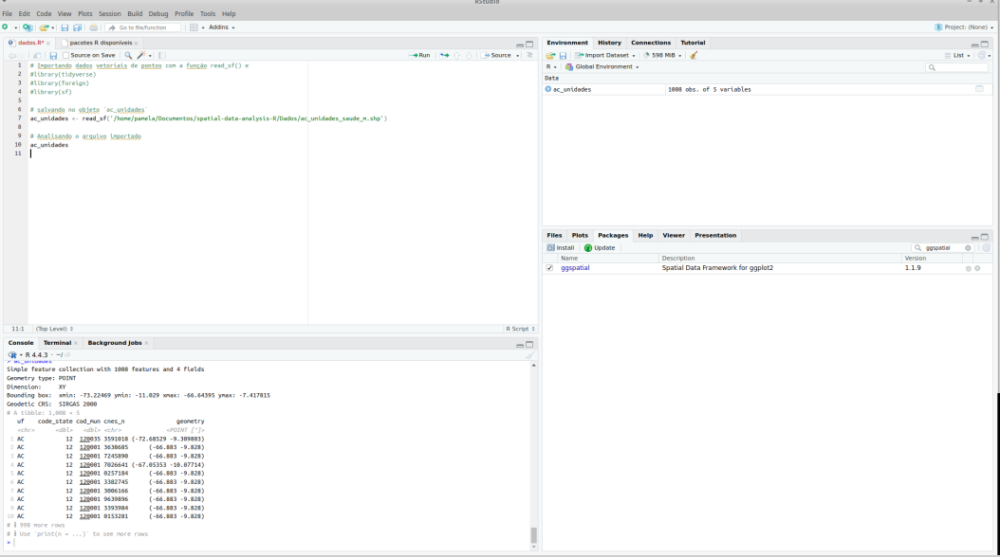
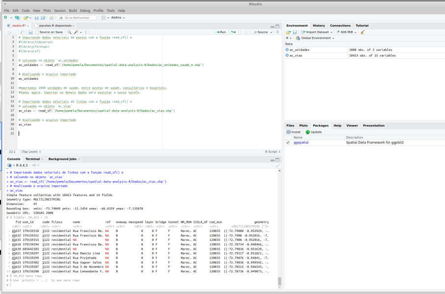
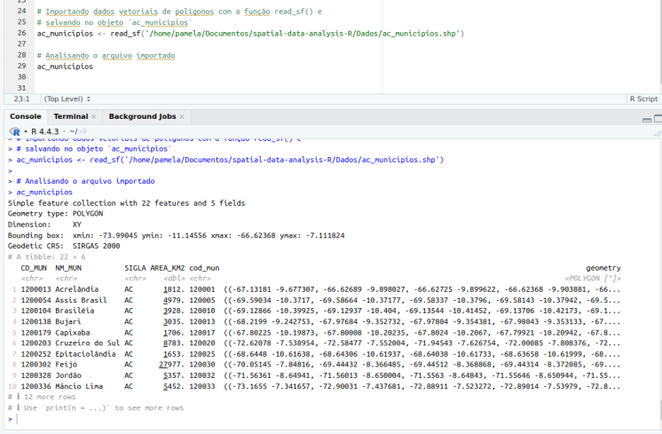
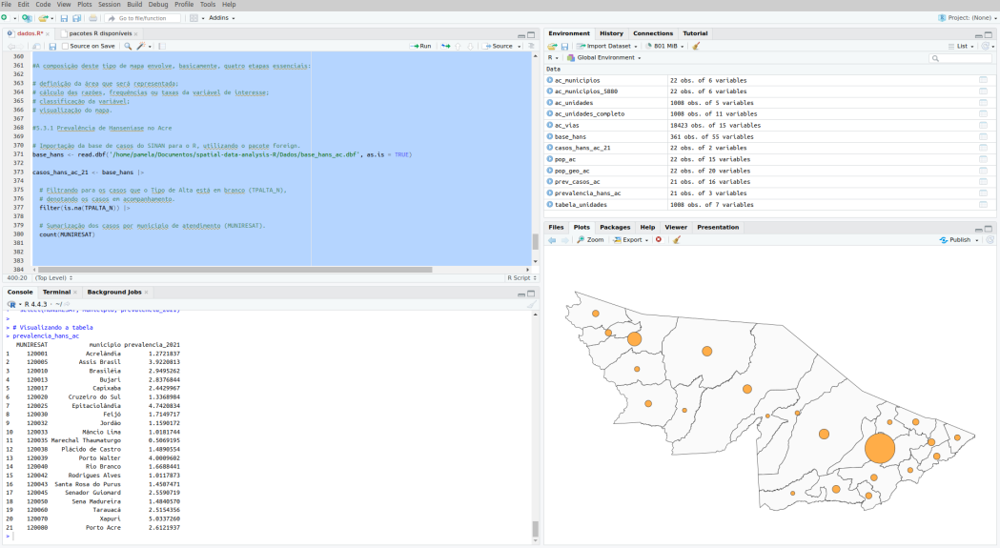
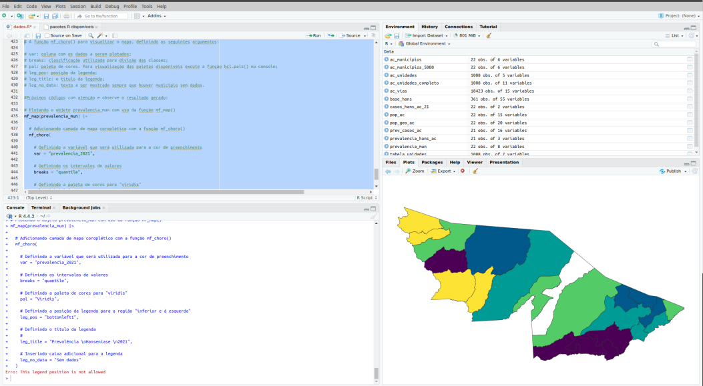

<br>

<div align="center">
    <div style="display: flex; align-items: center;">
        
    </div>
</div>

<br> 

#

No curso, aprendi a utilizar análises de bancos de dados de saúde para construir mapas de interesse epidemiológico. O geoprocessamento é uma ferramenta essencial na Vigilância em Saúde, permitindo a análise da distribuição espacial de doenças, eventos e agravos relacionados à saúde.

Através da produção de mapas temáticos, que representam áreas com diferentes valores, taxas ou coeficientes, é possível construir mapas epidemiológicos. Esses mapas facilitam a identificação, localização, acompanhamento e monitoramento de populações, permitindo direcionar as ações da Vigilância em Saúde com maior efetividade e precisão.

A utilização de técnicas de geoprocessamento é essencial na epidemiologia, pois proporciona uma visão ampla da saúde da população dentro de seu contexto social, histórico, político, cultural e ambiental. Atualmente, diversos softwares, como TabWin, ArcGIS, QGIS, Google Maps e Google Earth, auxiliam nas análises espaciais.

Neste curso, foram apresentados métodos básicos para o tratamento de dados na Vigilância em Saúde utilizando a linguagem de programação R. Automatizar a análise e o processamento desses dados melhora a detecção precoce de epidemias, tornando o trabalho mais eficiente e reduzindo o tempo dedicado a essas tarefas. O R se destaca como uma ferramenta poderosa para essas aplicações.

# 2.1 Quais são os dados espaciais utilizados na análise de dados em R para a Vigilância em Saúde?

Na análise de dados em R aplicada à Vigilância em Saúde, os dados espaciais desempenham um papel fundamental na identificação e monitoramento de padrões epidemiológicos. Esses dados podem incluir:

*   Endereços e coordenadas geográficas de pacientes, unidades de saúde e áreas de risco.
*   Setores censitários e dados demográficos, como densidade populacional e condições socioeconômicas.
*   Registros de casos de doenças georreferenciados, permitindo a análise da distribuição espacial de surtos.
*   Infraestrutura de saúde, como hospitais, postos de atendimento e cobertura vacinal por região.
*   Fatores ambientais, incluindo qualidade do ar, disponibilidade de água potável e áreas de saneamento precário.

O uso do R possibilita a manipulação, visualização e modelagem desses dados, auxiliando na tomada de decisões estratégicas para a saúde pública.

# 3. Criando um mapa

# 3.1 Elementos básicos na composição de um mapa

No R, as coordenadas são indexadas pelo código EPSG. O sistema geográfico adotado pelo Brasil, SIRGAS2000, possui o código 4674. Já o sistema UTM possui diferentes códigos conforme o fuso. Quando um município está entre dois fusos, recomenda-se o uso de uma projeção cônica com o código EPSG 5880 para a elaboração de mapas.
<p align="center">
    
</p>


No R, a criação de mapas pode ser feita com diversos pacotes. Entre os principais estão o <b> sf </b>, para manipulação de dados espaciais, e pacotes mais intuitivos, como <b> mapsf</b> e <b>tmap</b>. Vamos explorá-los ao longo do curso, mas primeiro, é necessário instalá-los e carregá-los.

```R
# Instalando e carregando os pacotes necessários

if(!require(tidyverse)) install.packages("tidyverse");library(tidyverse)
if(!require(foreign)) install.packages("foreign");library(foreign)
if(!require(readxl)) install.packages("readxl");library(readxl)
if(!require(janitor)) install.packages("janitor");library(janitor)
if(!require(stringi)) install.packages("stringi");library(stringi)
if(!require(sf)) install.packages("sf");library(sf)
if(!require(mapsf)) install.packages("mapsf");library(mapsf)
if(!require(tmap)) install.packages("tmap");library(tmap)
if(!require(ggspatial)) install.packages("ggspatial");library(ggspatial)
```

# 3.1.1 O uso das cores em mapas

Ao elaborar mapas, é essencial que o profissional da Vigilância em Saúde defina quais informações destacar e utilize cores estrategicamente. A escolha das cores não é apenas uma questão estética, mas um recurso de comunicação que, quando bem aplicado, torna a interpretação dos dados mais eficiente. A paleta deve ser adequada ao tipo de variável representada, garantindo clareza e precisão na análise.

No R, o símbolo <b> # </b> indica um código hexadecimal de cor. Por exemplo, <b>  #000000 </b>  representa preto e <b> #FFFFFF </b> branco. Combinando as três cores básicas, é possível definir mais de 16 milhões de cores e tons de cinza.

<p align="center">
    
</p>

# 3.2 Conhecendo e importando dados vetoriais

No R, o pacote sf permite a importação de arquivos vetoriais, armazenando geometrias em colunas dentro de <b>  dataframes </b>. Isso facilita a manipulação com <b>  dplyr </b> e a visualização com <b>  ggplot2</b>.

Para importar dados de pontos representando a localização das unidades de saúde do Estado do Acre, utilizamos a função read_sf() do pacote sf. Essa função lê arquivos vetoriais e é capaz de importar diferentes tipos de geometrias, como pontos, linhas e polígonos, sendo especialmente útil para representar locais específicos no espaço por meio de coordenadas. No caso desta tarefa, os dados de coordenadas das unidades de saúde, identificados como ac_unidades, estão disponíveis no menu lateral “Arquivos” do curso, junto com arquivos auxiliares. É importante garantir que todos os arquivos sejam baixados na mesma pasta antes de executar o código no RStudio.

``` R
# Instalando e carregando os pacotes necessários

# Importando dados vetoriais de pontos com a função read_sf() e
#library(tidyverse)
#library(foreign)
#library(sf)

# salvando no objeto `ac_unidades`
ac_unidades <- read_sf('/home/pamela/Documentos/spatial-data-analysis-R/Dados/ac_unidades_saude_m.shp')

```

(ac_unidades) no Painel Console e veja o output:

``` R
# Analisando o arquivo importado
ac_unidades

#importamos 1008 unidades de saúde, entre postos de saúde, consultórios e hospitais. 

```

<p align="center">
    
</p>


com o apresentado acima deve ser mostrado no seu RStudio. O output contém os seguintes elementos:

1.  a quantidade de registros e atributos (número de linhas e colunas);
2.  o tipo de geometria;
3.  os limites geográficos dos dados (também chamado de bounding box );
4.  o sistema de referência (sigla CRS);
5.  o objeto geográfico em si (sf - simple feature);
6.  a coluna do tipo lista contendo a geometria (objeto de classe sfc - sigla para simple feature column);
7.  a geometria individual referente ao objeto geográfico identificado pelo item 5 (objeto de classe sfg - sigla para simple feature geometry).

<p align="center">
    
</p>

Para importar um arquivo vetorial de linhas, {ac_vias}, que representa as ruas e rodovias do Estado do Acre, utilizamos novamente a função read_sf() do pacote sf. Arquivos vetoriais de linhas são compostos por conjuntos de pares de coordenadas conectados, representando objetos geográficos que possuem comprimento, como estradas ou ruas. Essas geometrias são úteis para análises de distâncias, padrões de deslocamento e outras relações espaciais.

Certifique-se de baixar o arquivo ac_vias e os arquivos auxiliares na mesma pasta antes de executar o código no seu RStudio. O processo é o mesmo utilizado anteriormente para os dados de pontos.

``` R
# Importando dados vetoriais de linhas com a função read_sf() e
# salvando no objeto `ac_vias`
ac_vias <- read_sf('/home/pamela/Documentos/spatial-data-analysis-R/Dados/ac_vias.shp')

# Analisando o arquivo importado
ac_vias
#importamos 18423 linhas entre rodovia e ruas. 
```

<p align="center">
    
</p>

Para finalizar a importação dos dados, vamos importar os limites administrativos dos municípios do Acre, representados pelo arquivo {ac_municipios}, utilizando a função read_sf(). Arquivos vetoriais de polígonos são compostos por conjuntos de linhas que formam uma estrutura fechada, representando áreas ou territórios, como limites municipais, áreas de risco, regiões climáticas, entre outras. Certifique-se de baixar o arquivo ac_municipios e os arquivos auxiliares na mesma pasta antes de executar o código no RStudio.

``` R
# Importando dados vetoriais de polígonos com a função read_sf() e
# salvando no objeto `ac_municipios` 
ac_municipios <- read_sf('/home/pamela/Documentos/spatial-data-analysis-R/Dados/ac_municipios.shp')

# Analisando o arquivo importado
ac_municipios
```

<p align="center">
    
</p>

# 3.3.1 Usando Função base plot()

Vamos iniciar com o arquivo {ac_municipios}, que contém dados vetoriais de polígonos representando os limites dos municípios do Acre. Em práticas de Vigilância em Saúde, arquivos semelhantes podem representar bairros, áreas de endemias, regiões administrativas, entre outros. O processo de visualização é o mesmo para diferentes tipos de dados vetoriais.

Utilizando a função plot(), o argumento essencial é o objeto a ser visualizado. Também podemos combinar com a função st_geometry() do pacote sf para visualizar apenas a geometria, sem os demais campos. Execute o comando no seu RStudio para gerar a plotagem do objeto.

``` R
# Plotando e visualizando o objeto `ac_municipios`
plot(x = st_geometry(ac_municipios))
```
<p align="center">
    
</p>

A visualização inicial do mapa pode ser aprimorada com argumentos adicionais para melhorar a comunicação, como:

*   axes: adiciona coordenadas nos eixos X e Y;
*   graticule: exibe uma grade de coordenadas;
*   col: define a cor de preenchimento (para polígonos);
*   xlab e ylab: definem os rótulos dos eixos;
*   main: adiciona um título centralizado no topo.

Esses elementos ajudam a criar um mapa mais completo, com informações essenciais. Execute o código no RStudio para gerar um mapa aprimorado, embora ainda simplificado.

``` R
# Plotando e visualizando o objeto ac_municipios
plot(
  
  # Definindo o objeto que será utilizado para a visualização do mapa
  x = st_geometry(ac_municipios),
  
  # Definindo como verdadeiro o argumento para plotagem das coordenadas 
  # nos eixos do gráfico
  axes = TRUE,
  
  # Definindo como verdadeiro o argumento para plotagem da grade com as
  # coordenadas
  graticule = TRUE,
  
  # Definindo a cor de preenchimento (código hexadecimal)
  col = "#FAFAFA",
  
  # Definindo os rótulos dos eixos x e y
  xlab = "longitude",
  ylab = "latitude"
)

```

<p align="center">
    
</p>

O Estado do Acre está localizado no extremo oeste do Brasil, com longitudes variando de 67º a 74º oeste (representado pela letra W) e latitudes de 7º a 11º sul (representado pela letra S). Para aprimorar a qualidade da visualização, utilizaremos o pacote ggplot2, que oferece recursos avançados para criar gráficos e mapas de alta qualidade. Vamos aplicar ggplot2 para melhorar a representação dos dados espaciais.


# 3.3.2 Usando o pacote ggplot2

O pacote ggplot2 é uma ferramenta poderosa para visualização de dados, desenvolvida por Hadley Wickham, e é parte do tidyverse, um conjunto de pacotes voltado para análises de dados. Através de uma gramática de gráficos, o ggplot2 simplifica a criação de gráficos avançados e permite uma sobreposição de camadas, o que é especialmente útil para visualizações geoespaciais.

Para sobrepor as camadas de arquivos importados anteriormente (unidades de saúde, ruas e limites de municípios), utilizaremos a função geom_sf(). Essa função permite a visualização de objetos importados pelo pacote sf, com o argumento obrigatório data (o objeto sf importado). Além disso, utilizaremos argumentos estéticos como:

*   fill: define a cor de preenchimento, ideal para polígonos;
*   color: define a cor das linhas e pontos, útil para geometrias baseadas em linhas ou pontos.

Esse processo permitirá criar um mapa mais detalhado e informativo, combinando diversas camadas de dados geoespaciais.

``` R
#fill: cor do preenchimento quando o objeto for composto por polígonos e,
#color: cor das linhas e pontos, quando o objeto for compostos por estas geometrias.

# Utilizando a função ggplot() para plotagem dos mapas
ggplot() +
  
  # Plotando o objeto de polígono com os contornos do estado
  # O argumento "fill" define a cor de preenchimento
  geom_sf(data = ac_municipios, fill = "#FAFAFA") +
  
  # Plotando o objeto de linhas para visualização de estradas
  # O argumento "color" define a cor das linhas
  geom_sf(data = ac_vias, color = "#BABABA") +
  
  # Plotando o objeto de pontos para visualização das unidades de saúde
  # O argumento "color" define a cor de preenchimento
  geom_sf(data = ac_unidades, color = "#00DD00")


```
<p align="center">
    
</p>

Além disso, o ggplot2 possui um conjunto de configurações contidos em temas que padronizam a cor do fundo e das linhas da latitude e longitude. Alguns dos temas disponíveis são:

*   theme_grey() (ou theme_gray()): tema padrão (como o visto acima);
*   theme_bw(): uma variação do padrão que usa fundo branco e linhas cinzas;
*   theme_linedraw(): um tema com apenas linhas pretas de várias larguras sobre fundo branco;
*   theme_light(): semelhante ao anterior, mas com linhas e eixos cinza claro, para dirigir mais atenção para os dados;
*   theme_dark(): “o primo escuro” de theme_light(), com linhas de larguras semelhantes, mas com um fundo escuro. Útil para fazer saltar linhas de cores finas;
*   theme_minimal(): um tema minimalista, sem anotações ou fundo;
*   theme_classic(): Um tema de aspecto “clássico”, com linhas de eixo x e y destacado e nenhuma linha de grade (as linhas internas do gráfico);
*   theme_void(): um tema completamente vazio, apresentando somente o mapa.

Vamos utilizar o tema theme_bw() no nosso próximo mapa.

Agora vamos utilizar o pacote ggspatial para compor os elementos como escala e seta de norte. Para isso, vamos utilizar as funções annotation_scale(), que sobrepõe uma escala gráfica no mapa e annotation_north_arrow(), que sobrepõe uma seta de norte. Os argumentos dessas funções são:

*   location: posição do elemento. Neste argumento podem ser usadas as siglas abaixo:
    *   tr: top right, acima à direita;
    *   tl: top left, acima à esquerda;
    *   br: bottom right, abaixo à direita;
    *   bl: bottom left, abaixo à esquerda.
*   height: altura. Necessário utilizar a função unit() do pacote * *   *   ggplot2 para especificar a unidade de medida que, no nosso caso, será centímetros;
*   style: somente para a seta. É definido um estilo para a seta.

Para as legendas, vamos utilizar o recurso estético da função aes() do pacote ggplot2 junto com as funções scale_color_manual() e scale_fill_manual(), ambas do mesmo pacote ggplot2. Com a função aes(), podemos definir um codinome para a cor que vamos utilizar nas geometrias (fill e color) e utilizar as demais para formatar rótulos e cores, propriamente ditas.

``` R
# Utilizando a função ggplot() para plotagem dos mapas
ggplot()+
  
  # Adicionando camada com os limites poligonais do estado do AC com o 
  # objeto `ac_municipios` e a função geom_sf().
  # O argumento "fill" define o codinome da cor de preenchimento
  geom_sf(data = ac_municipios, aes(fill = "cor_municipios")) + 
  
  # Adicionando camada com objeto de linhas representando as vias com o 
  # objeto `ac_vias` e a função geom_sf()
  # O argumento "color" define o codinome da cor das linhas
  geom_sf(data = ac_vias, aes(color = "cor_ruas")) +
  
  # Adicionando camada com objeto de pontos  representando unidades de
  # saúde com o objeto `ac_unidades` e a função geom_sf()
  # O argumento "color" define o codinome da cor de preenchimento
  geom_sf(data = ac_unidades, aes(color = "cor_unidades")) +

 # Definindo a escala gráfica do mapa com a função annotation_scale()
  annotation_scale(location = "br",
                   height = unit(.1, "cm")) +
    
  # Definindo a visualização de seta apontada para o Norte  
  annotation_north_arrow(location = "tr",
                         height = unit(1, "cm"),
                         style = north_arrow_fancy_orienteering) +
  
  # Criando a legenda das linhas e pontos
  scale_color_manual(
    name = "",
    guide = guide_legend(override.aes = list(linetype = c("solid", "blank"), 
                                             shape = c(NA, 16))),
    values = c('cor_ruas' = '#BABABA', 'cor_unidades' = '#FF0000'),
    labels = c("Vias", "Unidades de saúde")
  ) +
  
  # Criando a legenda dos polígonos
  scale_fill_manual(
    name = "",
    values = c('cor_municipios' = '#FAFAFA'),
    labels = "Municípios"
  ) +
  
  # Definindo o título e rótulos dos eixos do gráfico  
  labs(title = "Unidades de saúde e arruamento do Estado do Acre, 2022.",
       x = "longitude",
       y = "latitude",
       caption = "Fonte dos dados: IBGE e Ministério da Saúde") +
  
  # Adicionando o tema
  theme_bw()

```
<p align="center">
    
</p>


# 5. Criação de mapas temáticos

Mapas temáticos são aqueles destinados a representar quaisquer fenômenos distribuídos geograficamente, indo além da representação ou visualização do espaço em si. A representação temática busca explorar, analisar e sintetizar dados sobre um determinado assunto e, por vezes, correlacionar com outros tipos de dados. Dessa forma, utilizam-se dados gráficos e não gráficos já existentes para compor uma análise. Eles são muito utilizados nas pesquisas socioeconômicas, de saúde e ambientais.

# 5.1 Mapa de símbolos proporcionais

Mapas de símbolos proporcionais representam a ocorrência de um evento em valores absolutos por meio da variação proporcional do tamanho de uma figura geométrica, geralmente círculo, sobrepostos sobre a unidade territorial. O círculo é localizado conforme a posição real do evento ou atribuído à localização de referência, como o centro geográfico (centróide) de um município ou de um bairro.

Para demonstrar este mapa, vamos utilizar os dados de população do estado do Acre, segundo os municípios. Nós utilizamos estes dados no curso básico “Análise de dados para a Vigilância em Saúde” e retornaremos a eles aqui. Primeiro, importaremos os dados, em seguida vamos uni-los à base geográfica utilizando o geocódigo do município (o código do IBGE) e, finalmente, vamos plotar o mapa.

A nossa base de população contém dados do estado do Acre de 2009 a 2021. Ao importá-la, perceba que o comando possui um argumento chamado col_types. Esse argumento é necessário para garantir que a primeira coluna do arquivo, chamada “Codigo”, se mantenha como o formato original “character”.

Além disso, vamos padronizar o nome das colunas (minúsculas, sem acento, sem espaço e sem colunas começando com números) utilizando a função clean_names() do pacote janitor (perceba que após corrigir o nome das colunas, aquelas que iniciavam com números, possuem a letra “x” no lugar). Execute o código:

``` R
# A nossa base de população contém dados do estado do Acre de 2009 a 2021. 
# Ao importá-la, perceba que o comando possui um argumento chamado col_types. 
# Esse argumento é necessário para garantir que a primeira coluna do arquivo, chamada “Codigo”,
# se mantenha como o formato original “character”.

# Carregando tabela com dados de população do acre para o objeto pop_ac
# utilizando a função read_csv2()
pop_ac <- read_csv2('/home/pamela/Documentos/spatial-data-analysis-R/Dados/pop_ac_09_21.csv', col_types = list("character"))

# Padronizando o nome das colunas utilizando a função `clean_names()`
# do pacote janitor
pop_ac <- clean_names(pop_ac)
```

vamos unir à base geográfica de municípios que será, nesse caso, nosso mapa base. Para isso, vamos utilizar a função left_join() do pacote dplyr. Como o geocódigo possui nomes diferentes em cada base, vamos indicar no argumento by quais colunas serão utilizadas como chave.

``` R
# Unindo a tabela ac_municipios_5880 com pop_ac com a função left_join()
pop_geo_ac <- ac_municipios_5880 |>
  
  # A ligação é feita pela correspondência entre as colunas "cod_mun" e "codigo"
  left_join(pop_ac, by = c('cod_mun' = 'codigo')) 

```

plotar o mapa utilizando a coluna da população de 2021 (“x2021”) no argumento var. Note que ao utilizar o pacote mapsf temos uma redução da necessidade de várias linhas de comandos. A função mf_prop() já calcula o tamanho dos círculos, classifica e posiciona a legenda.


``` R
# Plotando o objeto pop_geo_ac com uso da função mf_map()
mf_map(pop_geo_ac) |>
  
  # Indicando o tamanho proporcional da população com uso da função mf_prop()
  mf_prop(var = "x2021")

```

<p align="center">
    
</p>

# 5.2 Prevalência de Hanseníase no Acre

A prevalência de hanseníase estima a magnitude da endemia no Acre. Ela deve ser estudada com base na totalidade de casos em tratamento no momento da realização desta avaliação. Uma alta prevalência (valores acima de 5 casos por 10 mil habitantes) pode indicar um cenário de baixo desenvolvimento socioeconômico e falta de ações efetivas do município para o controle da doença. Por outro lado, a baixa prevalência (valores menores que 1 caso por 10 mil habitantes) pode indicar que a hanseníase não deve considerada um problema de saúde pública.

No código abaixo vamos importar os casos de hanseníase do SINAN no ano de 2021. Este banco de dados se encontra no menu lateral “Arquivos” do curso. Em seguida, vamos calcular a frequência de casos em andamento por município de residência atual e unir com a população residente. Por último, vamos calcular a prevalência para todos os municípios do estado e salvar esses cálculos no objeto {prevalencia_hans_ac}.


``` R
# Importação da base de casos do SINAN para o R, utilizando o pacote foreign.
base_hans <- read.dbf('/home/pamela/Documentos/spatial-data-analysis-R/Dados/base_hans_ac.dbf', as.is = TRUE)

casos_hans_ac_21 <- base_hans |>
  
  # Filtrando para os casos que o Tipo de Alta está em branco (TPALTA_N), 
  # denotando os casos em acompanhamento.
  filter(is.na(TPALTA_N)) |>
  
  # Sumarização dos casos por município de atendimento (MUNIRESAT).
  count(MUNIRESAT)


prev_casos_ac <- casos_hans_ac_21 |>
  
  # Unindo a tabela de casos à tabela de população pelo geocódigo do município de 
  # atendimento.
  left_join(pop_ac, by = c("MUNIRESAT" = "codigo")) |> 
  
  # Filtrando os municípios que não foram encontrados na união.
  filter(!is.na(MUNIRESAT))

# Calculando a prevalência por município e seleção das colunas necessárias para o 
# mapa.
prevalencia_hans_ac <- prev_casos_ac |> 
  mutate(prevalencia_2021 = (n / x2021) * 10000) |> 
  select(MUNIRESAT, municipio, prevalencia_2021)

# Visualizando a tabela
prevalencia_hans_ac


```

<p align="center">
    
</p>


Primeiro, vamos unir a tabela de prevalência com os municípios, utilizando como geocódigo a variável com código do IBGE em ambas as tabelas. Execute o código a seguir:


``` R
# Unindo a tabela `prevalencia_hans_ac` com `ac_municipios_5880` 
# com a função left_join() e salvando no objeto `prevalencia_mun`
prevalencia_mun <- left_join(

  x = ac_municipios_5880,
  y = prevalencia_hans_ac,
  
  # A ligação é feita pela correspondência entre as colunas
  #  "cod_mun" e "MUNIRESAT"
  by = c("cod_mun" = "MUNIRESAT")
) 


```

Em seguida, vamos utilizar a função mf_choro() para visualizar o mapa, definindo os seguintes argumentos:

*   var: coluna com os dados a serem plotados;
*   breaks: classificação utilizada para divisão das classes;
*   pal: paleta de cores. Para visualização das paletas disponíveis excute a função hcl.pals() no console;
*   leg_pos: posição da legenda;
*   leg_title: o título da legenda;
*   leg_no_data: texto a ser mostrado sempre que houver município sem dados.

``` R
# Plotando o objeto prevalencia_mun com uso da função mf_map()
mf_map(prevalencia_mun) |>
  
# Adicionando camada de mapa coroplético com a função mf_choro()  
mf_choro(
  
  # Definindo a variável que será utilizada para a cor de preenchimento
  var = "prevalencia_2021",
  
  # Definindo os intervalos de valores
  breaks = "quantile",
  
  # Definindo a paleta de cores para "viridis"
  pal = "Viridis",
  
  # Definindo a posição da legenda para a região "inferior e à esquerda"
  leg_pos = "bottomleft1",
  
  # Definindo o título da legenda
  # 
  leg_title = "Prevalência \nHanseníase \n2021",
  
  # Inserindo caixa adicional para a legenda
  leg_no_data = "Sem dados"
)
```


<p align="center">
    
</p>

# 5.3 Coeficiente de Mortalidade Infantil no município de São Paulo

A taxa de mortalidade infantil representa o número de óbitos ocorridos em crianças menores de um ano de idade por mil nascidos vivos no mesmo período. Este indicador é muito importante por permitir avaliar as condições de vida e de saúde de uma dada população. Com o cálculo da sua taxa, é possível estimar o risco de uma criança morrer antes de chegar a um ano de vida.

O indicador de mortalidade infantil, em especial a mortalidade pós-neonatal, quando elevadas refletem as precárias condições de vida e saúde e valores abaixo do nível de desenvolvimento social e econômico. Já taxas reduzidas podem sinalizar bons indicadores sanitários e sociais, mas também podem encobrir más condições de vida em segmentos sociais específicos.

Vamos começar importando o arquivo {cmi_sp_19_21.csv} com os dados de mortalidade infantil do município de São Paulo entre 2019 e 2021. Este arquivo se encontra no menu lateral “Arquivos” do curso. Note que, no código abaixo, vamos utilizar o argumento locale na função read_csv2() para corrigir a codificação dos caracteres do arquivo para os padrões brasileiros. Replique o código no seu RStudio:

``` R
#Importando o arquivo{`CID-cmi_sp_19_21.csv`} para o `R`
cmi_sp_19_21 <- read_csv2("Dados/cmi_sp_19_21.csv",
                          locale = locale(encoding = "ISO-8859-1"))


# Visualizando o objeto
cmi_sp_19_21
 
```
<p align="center">
    
</p>

O arquivo importado contém 5 colunas e 98 linhas, com nomes de colunas que incluem espaços, números e uma coluna "Total" desnecessária. Além disso, os coeficientes de mortalidade infantil estão no formato character, o que exige conversão.

O próximo passo envolve a padronização dos nomes das colunas e dos distritos administrativos, removendo acentos e sinais de pontuação. Para facilitar a análise, será realizada uma pivotagem, organizando os dados de mortalidade infantil em uma única coluna, com anos e seus respectivos valores.

Para esses ajustes, serão utilizadas funções dos pacotes <b> janitor, stringr e stringi</b>. O código correspondente deve ser executado para garantir a formatação correta dos dados.

``` R
# Criando um novo objeto com as correções feitas
cmi_sp <- cmi_sp_19_21 |> 

  # Padronizando o nome das colunas utilizando a função `clean_names` do
  # pacote `janitor`
  clean_names() |> 
  
  # Retirando a coluna `total`, pois não será necessária
  select(-total) |> 
  
  # Retirando as linhas que não corresponde a nenhum distrito administrativo,
  # utilizando a função `filter()` do pacote `dplyr`
  filter(
    dist_administrativo_resid != "Endereço não localizado" ,
    dist_administrativo_resid != "Ignorado"
  ) |>
  
  # Padronizando as colunas de ano para uma coluna só utilizando a função
  # `pivot_longer()` do pacote `dplyr`. Note que vamos retirar a letra "x",
  # adicionada pela função `clean_names()`
  pivot_longer(
    cols = c(x2019, x2020, x2021),
    names_to = "ano",
    values_to = "cmi",
    names_prefix = "x"
    ) |> 
  
  # Criando as novas colunas corrigidas
  mutate(
    
    # Primeiro criando a coluna que receberá os nomes dos distritos 
    # administrativos corrigidos (passaremos para maiúsculo utilizando a 
    # função `str_to_upper()` do pacote `stringr` e retiraremos os acentos
    # utilizando a função `stri_trans_general()` do pacote `stringi`)
    ds_nome = str_to_upper(dist_administrativo_resid) |>
      stri_trans_general("latin-ascii"),
    
    # Depois, a coluna que receberá os coeficientes corrigidos, utilizando a 
    # função `str_replace_all()` do pacote `stringr`, e transformados para 
    # valores numéricos utilizando a função `as.numeric()`
    cmi_num = str_replace_all(cmi, "\\,", "\\.") |>
      str_replace_all("\\-", NA_character_) |>
      as.numeric()
  )


 # Visualizando as primeiras linhas do objeto `cmi_sp`
head(cmi_sp)
  ```

<p align="center">
    
</p>

Agora que as colunas foram corrigidas, o próximo passo é <b> importar o arquivo vetorial dos distritos administrativos de São Paulo </b>. O arquivo {sp_da.gpkg} está disponível para download no menu lateral “Arquivos” do curso.

Para realizar a importação, utilizaremos a função read_sf() do pacote sf, armazenando os dados no objeto {distrito_adm_sp}. <b> Execute o código correspondente no seu RStudio para carregar os dados corretamente </b>.


``` R
# Importando o arquivo{`sp_da.gpkg`} para o `R`
distrito_adm_sp <- read_sf("Dados/sp_da.gpkg")

# Visualizando o objeto salvo
distrito_adm_sp
```
<p align="center">
    
</p>


A variável ds_nome, que contém os nomes dos distritos administrativos, já está <b> padronizada em letra maiúscula e sem acentos,</b> não necessitando de correções adicionais.

Agora, o próximo passo é <b> unir o arquivo vetorial dos distritos administrativos à tabela de coeficiente de mortalidade infantil.</b> A união será feita utilizando a variável ds_nome, presente em ambos os arquivos, como chave de ligação.

``` R
# Unindo a tabela `distrito_adm_sp` com `cmi_sp` 
# com a função left_join() e salvando no objeto `cmi_sp_map`
cmi_sp_map <- left_join(

  x = distrito_adm_sp,
  y = cmi_sp,
  
  # A ligação é feita pela variável `ds_nome`
  by = "ds_nome"
)
```

Vamos criar um <b> mapa coroplético</b> para comparar os coeficientes de mortalidade infantil ao longo dos três anos, destacando os distritos com maiores valores em cores mais intensas e menores valores em cores mais claras.

Antes disso, utilizamos a <b> função hist()</b> para visualizar a distribuição dos valores da variável <b> cmi_num </b>, facilitando a definição de intervalos para a categorização no mapa.

Agora, podemos prosseguir com a criação do mapa temático.

``` R
hist(x = cmi_sp_map$cmi_num)
```

<p align="center">
    
</p>
